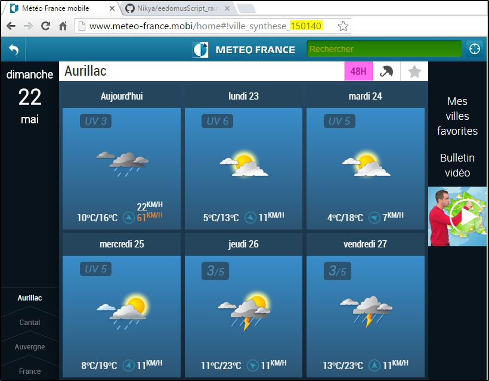

# eedomus script : Rain trend

Version : 1.0

Auteur : [Nikya](https://github.com/Nikya)


## Description
*eedomusScript_rainTrend* est un script pour la box domotique *eedomus*.

Il permet de connaitre les prévisions pluvieuses des `x` prochaines heures (de 3 à 48h).

Il se base sur les prévisions de [Météo France](http://www.meteo-france.mobi/home#!france)

## Installation
1. Télécharger le projet sur GitHub : [github.com/Nikya/eedomusScript_rainTrend](https://github.com/Nikya/eedomusScript_rainTrend/archive/master.zip)
1. Uploader le fichier *rain_trend.php* sur la box ([Doc eedomus scripts](http://doc.eedomus.com/view/Scripts#Script_HTTP_sur_la_box_eedomus))

## Tester
Ce script peut ensuite être testé au travers du lien suivant dans le navigateur

	http://[ip_de_votre_box]/script/?exec=rain_trend.php&cityId=[cityId]&slotCnt=[slotCnt]

Où il faut remplacer
- *[ip_de_votre_box]* : par l'IP de votre Box *eedomus*
- *[cityId]* : Par l'identifiant de la ville
- *[slotCnt]* : (Optionel) Par le nombre de slot à interpréter

Exemple

	http://192.168.1.2/script/?exec=rain_trend.php&cityId=150140

## Paramétrer

### cityId
Est un identifiant unique désignant un lieu.  
Pour l'obtenir :

1. Aller sur le site [meteo-france.mobi](http://www.meteo-france.mobi/home#!france)
1. Effectuer une recherche de la localisation souhaitée, dans le champs de recherche en haut à droite
1. Relever le numéro *ville_synthese* diponible dans l'URL



### slot et slotCnt

*slotCnt* est le nombre de *slot* à interpréter.

Un *slot* est une plage horaire de 3 heure consécutive.

La première plage correspond, à la plage suivant l'heure actuelle, au moment de l'appel du script.

Si ce paramètre n'est pas renseigné, il prend comme valeur par défaut `4`, soit les 12 prochaines heures.

Les plages horaires possibles sont les suivantes :
- 02-05
- 05-08
- 08-11
- 11-14
- 14-17
- 17-20
- 20-23
- 23-02

## Résultat

### rainyTrend
Le résultat contient, entre autre, une information `rainyTrend` qui est un indicateur de pluie dans les heures à venir.
Il est déterminé selon l'indice *Météo France* `probapluie` : Un pourcentage de risque de pluie  
Si dans les plages horaires à venir, l'indice `probapluie` dépasse 60%, alors l'indicateur `rainyTrend` est positioné à `1`  
Le nombre d'heure de prévision, à inclure dans le calcule de cette indicateur, est choisie par l'option *slotCnt* (voir paragraphe *slotCnt*)

### Format
Le résultat est au format XML.

Exemple de résultat
```xml
<data>
	<cityId>150140</cityId>
	<slotCnt>3</slotCnt>
	<cityName>Aurillac</cityName>
	<rainyTrend>1</rainyTrend>
	<slots>
		<slot>
			<slotname>0_17-20</slotname>
			<description>Pluie</description>
			<probapluie>90</probapluie>
		</slot>
		<slot>
			<slotname>0_20-23</slotname>
			<description>Rares averses</description>
			<probapluie>90</probapluie>
		</slot>
		<slot>
			<slotname>0_23-02</slotname>
			<description>Ensoleillé</description>
			<probapluie>10</probapluie>
		</slot>
	</slots>
</data>
```

### Correspondance XPATH

Les différentes informations possibles retournées par les Xpath suivants :

- `/data/cityId` : Rappel du cityId choisie
- `/data/slotCnt` : slotCnt nombre de plage horaire à interpréter
- `/data/cityName` : Le nom de la ville trouvée
- `/data/rainyTrend` : L'indicateur global de pluie
- `/data/slots` : Détails des plages horaires (Contient autant de *slot* que le paramètre *slotCnt* choisie)
- `/data/slots/slot[0]/slotname` : Est le nom de la plage horaire. C'est la concaténation du numéro du jour (0 pour aujourd'hui, 1 pour demain) et d'une plage horaire. (voir paragraphe *slotCnt*)
- `/data/slots/slot[0]/description` : Description des conditions météo
- `/data/slots/slot[0]/probapluie` : Indicateur de probabilité de pluie (Voir paragraphe *rainyTrend*)
- `/data/slots/slot[x]/...` : Remplacer x par un autre indice pour accéder aus slots suivants.

## Un exemple d'exploitation avec l'eedomus

Créer un nouveau périphérique de type *HTTP Capteur*

Renseigner les paramètres suivants :

- Type de données : `Texte`
- URL de la requête : `http://[VAR1]/script/?exec=rain_trend.php&cityId=[VAR2]&slotCnt=[VAR3]`
- Chemin XPATH : `/data/rainyTrend`
- Fréquence de la requête : `30`
- Variables utilisateur :
	- [VAR1] : `Localhost`
	- [VAR2] : `150140` (Le cityId)
	- [VAR3] : `3` (Le slotCnt)
